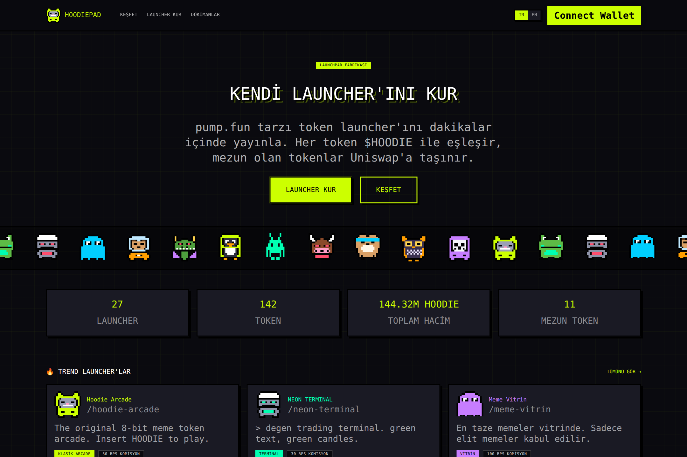
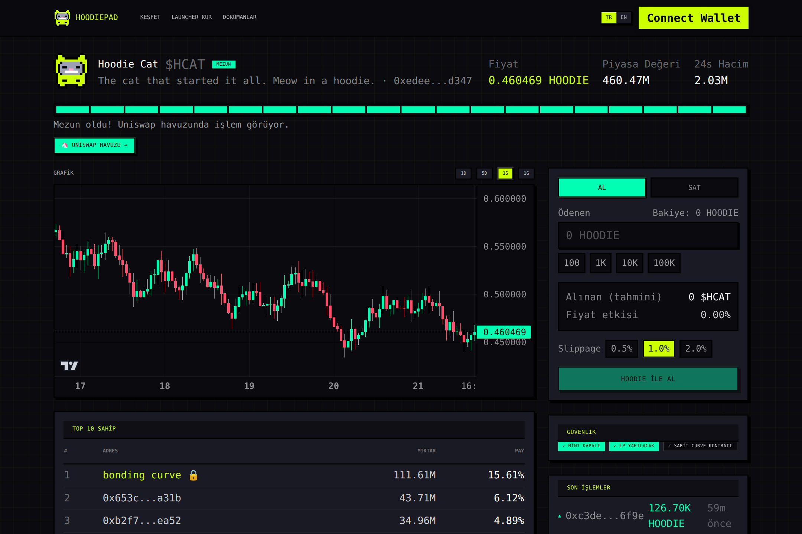
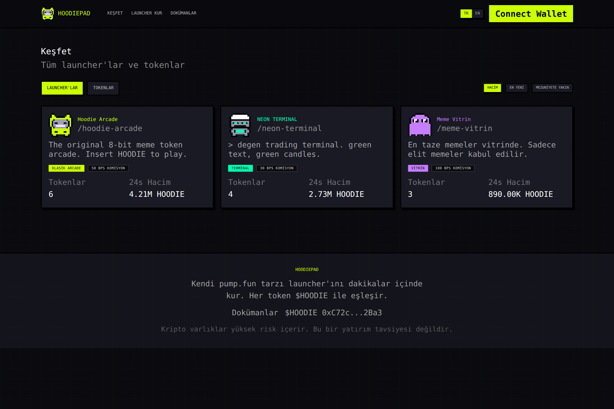
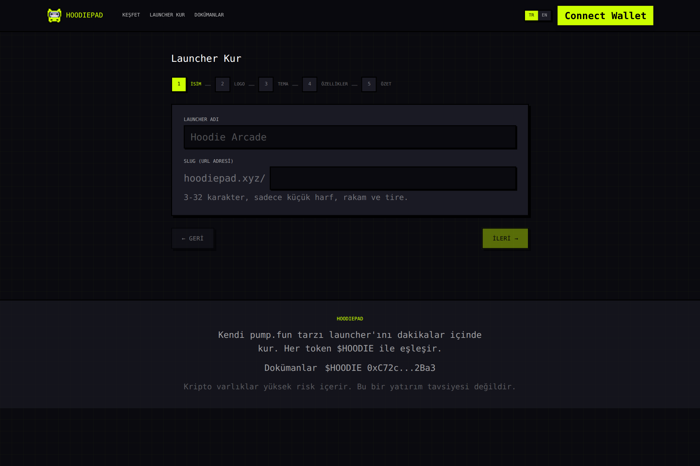
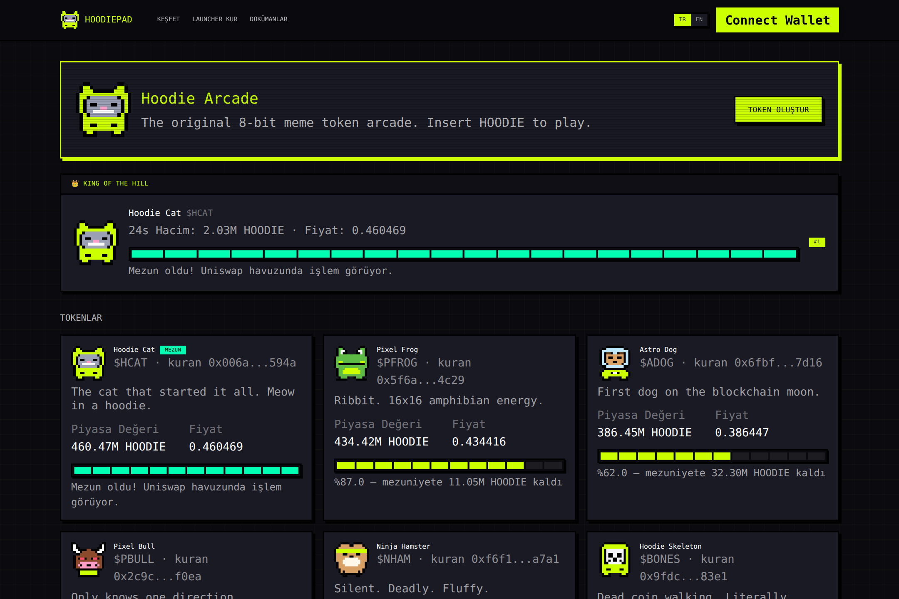
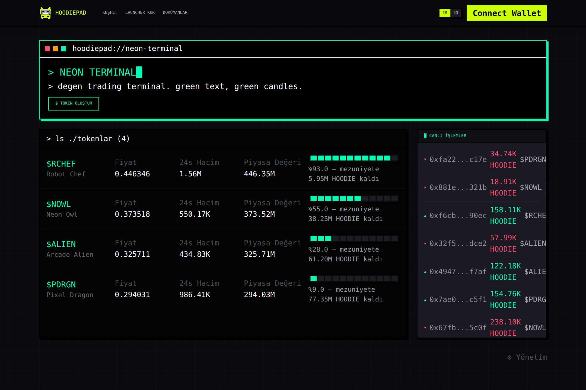

# HOODIEPAD 🧥⚡

> 🇹🇷 **Türkçe döküman için → [README.tr.md](README.tr.md)**

**Launch your own pump.fun-style launchpad with zero code.**

HOODIEPAD is a **launchpad factory** on EVM: anyone can fill in a short wizard and publish their own pump.fun-style token launcher at `site.com/<launcher-slug>` in minutes. Every token created on any launcher is **mandatorily paired with $HOODIE** (`0xC72c01AAB5f5678dc1d6f5C6d2B417d91D402Ba3`): all bonding-curve trading is HOODIE-denominated, and on graduation liquidity moves to a Uniswap V2 **TOKEN/HOODIE** pool with 100% of the LP burned. The whole platform speaks **pixel art** with a **Robin Neon (`#CCFF00`)** theme.

```
┌───────────────────────── FRONTEND (web/, Next.js 14) ─────────────────────────┐
│  main site · /create wizard · /[slug] themed launchers · /[slug]/token/[addr] │
└──────────────┬──────────────────────────────────┬─────────────────────────────┘
               │ wagmi/viem                       │ REST
┌──────────────▼──────────────┐      ┌────────────▼──────────────────────────────┐
│  CONTRACTS (contracts/)     │      │  INDEXER + API (indexer/, Ponder)         │
│  LauncherRegistry           │      │  events → Postgres → OHLCV candles        │
│  TokenFactory (EIP-1167)    │      │  /api/launchers /api/tokens/:a/candles …  │
│  BondingCurve (HOODIE x·y=k)│      └───────────────────────────────────────────┘
│  GraduationManager          │      ┌───────────────────────────────────────────┐
│  FeeSplitter + Timelock48   │      │  EXPORT (export-template/)                │
└─────────────────────────────┘      │  standalone Next.js launcher for GitHub/  │
                                     │  ZIP export, same contracts + public API  │
                                     └───────────────────────────────────────────┘
```

**Key architectural decision:** launchers do **not** get their own contract deployments. One shared, immutable contract set serves everyone; a launcher is an on-chain registry record (fee recipient + parameters) plus an off-chain theme config.

## Screenshots

| Home | Trade page |
|---|---|
|  |  |

| Explore | Launcher wizard |
|---|---|
|  |  |

| "Klasik Arcade" scheme | "Terminal" scheme |
|---|---|
|  |  |

## Monorepo

| Package | What | Status |
|---|---|---|
| [`contracts/`](contracts/) | Foundry project: registry, factory, curve, graduation, fee splitter, 48h timelock, unit + fuzz tests | ✅ compiles clean, E2E lifecycle verified |
| [`web/`](web/) | Next.js 14 main app: Pixel Arcade design system, 12 mascots, 5-step wizard, 3 layout schemes, trade page | ✅ builds |
| [`indexer/`](indexer/) | Ponder indexer: trades → OHLCV (1m/5m/1h/1d), REST API | ✅ typechecks |
| [`export-template/`](export-template/) | Standalone launcher UI a creator exports to GitHub/ZIP | ✅ builds |

---

## 1. Run locally (see the UI in 2 minutes)

Prerequisites: **Node.js ≥ 20** and **pnpm ≥ 9** (`npm i -g pnpm`).

```bash
git clone https://github.com/henrydev-dot/HOOOODLauncher.git
cd HOOOODLauncher
pnpm install
pnpm dev          # → http://localhost:3000
```

That's it. With **no configuration at all** the app runs in **demo mode**: every page (home, explore, the wizard, three themed demo launchers, the trade page with candlestick charts) renders with realistic built-in mock data, and wallet flows simulate transactions. Demo launchers to click through:

- `http://localhost:3000/hoodie-arcade` — "Klasik Arcade" scheme (King of the Hill)
- `http://localhost:3000/neon-terminal` — "Terminal" scheme (live ticker)
- `http://localhost:3000/meme-vitrin` — "Vitrin" scheme (hero + mascot)

Real on-chain flows activate automatically once you set contract addresses in the env (next sections).

---

## 2. Deploy the frontend (Vercel — ~5 minutes)

1. Go to **[vercel.com/new](https://vercel.com/new)** and import this GitHub repository.
2. Set **Root Directory** to `web` (Framework Preset: Next.js — auto-detected).
3. Click **Deploy**. No env vars are needed for demo mode.
4. (Later) add env vars under *Project → Settings → Environment Variables* to go live for real:

| Variable | What |
|---|---|
| `NEXT_PUBLIC_CHAIN_ID` | `11155111` for Sepolia, `1` for mainnet |
| `NEXT_PUBLIC_REGISTRY_ADDRESS` | LauncherRegistry address (setting this switches off demo mode) |
| `NEXT_PUBLIC_FACTORY_ADDRESS` | TokenFactory address |
| `NEXT_PUBLIC_CURVE_ADDRESS` | BondingCurve address |
| `NEXT_PUBLIC_GRADUATION_ADDRESS` | GraduationManager address |
| `NEXT_PUBLIC_FEESPLITTER_ADDRESS` | FeeSplitter address |
| `NEXT_PUBLIC_HOODIE_ADDRESS` | HOODIE token (default `0xC72c...2Ba3`; your MockHoodie on testnet) |
| `NEXT_PUBLIC_API_URL` | Indexer API base URL (empty = mock data) |
| `NEXT_PUBLIC_WC_PROJECT_ID` | WalletConnect Cloud project id (free at cloud.walletconnect.com) |

Full template: [`web/.env.example`](web/.env.example). Every push to `main` redeploys automatically.

---

## 3. Deploy the contracts

### 3a. Sepolia testnet (safe, free — recommended first)

Requires [Foundry](https://getfoundry.sh) (`curl -L https://foundry.paradigm.xyz | bash && foundryup`) and a throwaway wallet funded with Sepolia ETH ([faucet](https://sepoliafaucet.com)).

```bash
cd contracts
forge build && forge test        # everything must be green

TREASURY=<your_address> \
UNIV2_FACTORY=0xF62c03E08ada871A0bEb309762E260a7a6a880E6 \
UNIV2_ROUTER=0xeE567Fe1712Faf6149d80dA1E6934E354124CfE3 \
forge script script/Deploy.s.sol \
  --rpc-url https://ethereum-sepolia-rpc.publicnode.com \
  --private-key <DEPLOYER_KEY> --broadcast
```

Leaving `HOODIE` unset makes the script deploy a **MockHoodie** automatically — call its `mint(address,uint256)` to give yourself free test HOODIE. Copy the deployed addresses from the script output into the frontend + indexer env vars, and the whole lifecycle (create launcher → create token → trade → graduate to Uniswap) works end-to-end with zero financial risk.

### 3b. Ethereum mainnet — ⚠️ read this first

**Do not deploy to mainnet straight away.** This platform custodies real users' HOODIE. Hard prerequisites (see [`contracts/README.md`](contracts/README.md)):

1. **Verify the HOODIE token on Etherscan**: confirm `0xC72c...2Ba3` really lives on the network you target, has 18 decimals, and has no transfer tax / pause / upgrade hooks.
2. **Calibrate parameters** to HOODIE's market price (the 85M-HOODIE graduation threshold and 50k creation fee are token-count defaults from the spec).
3. **Independent security audit** (firm and/or Code4rena/Sherlock contest) + a bug bounty.
4. Then the same deploy command with mainnet values: `UNIV2_FACTORY=0x5C69bEe701ef814a2B6a3EDD4B1652CB9cc5aA6f`, `UNIV2_ROUTER=0x7a250d5630B4cF539739dF2C5dAcb4c659F2488D`, `HOODIE=0xC72c01AAB5f5678dc1d6f5C6d2B417d91D402Ba3`, and `--verify` for Etherscan verification. Hand the registry to the `Timelock48` (the deploy script already starts this) and soft-launch with small amounts.

---

## 4. Deploy the indexer (real data instead of mocks)

1. Create a free Postgres database at [neon.tech](https://neon.tech) (or Supabase).
2. On [Railway](https://railway.app) / [Fly.io](https://fly.io), deploy the repo with root directory `indexer` (start command `pnpm start`).
3. Set env vars from [`indexer/.env.example`](indexer/.env.example): `DATABASE_URL`, `CHAIN_ID`, `PONDER_RPC_URL_11155111` (or `_1`), the four contract addresses and their deploy block numbers.
4. Point the frontend's `NEXT_PUBLIC_API_URL` at the indexer's public URL. Charts, holders and trade feeds switch from mock to live automatically.

---

## Fee economy (defaults — admin-tunable behind a 48h timelock, hard-capped)

| Fee | Value | To |
|---|---|---|
| Launcher creation | 50,000 HOODIE | Platform treasury |
| Token creation | 500 HOODIE | 50% platform / 50% launcher owner |
| Trade fee | 1% | launcher's share = its `launcherFeeBps` (0–1%), remainder platform |
| Graduation fee | 2% of collected HOODIE | Platform treasury |
| Graduate call incentive | 0.05% | Whoever calls `graduate()` |

## Token lifecycle

1. **Create** — 1B fixed supply minted straight to the shared bonding curve. No owner, no mint function, no tax. Optional atomic "dev buy".
2. **Trade** — constant-product curve with virtual reserves (300M HOODIE / 1,073M tokens). Slippage protection mandatory; price comes only from curve state.
3. **Graduate** — at 85M HOODIE real reserve the curve freezes; anyone calls `graduate()`: a Uniswap V2 TOKEN/HOODIE pool is created, **100% of LP burned to `0xdead`** (or 12-month lock via config), leftover inventory burned.

## Deviations from the spec

- **Vendored micro-libraries instead of OpenZeppelin imports** (`contracts/src/vendor/`): same semantics, zero submodules → `forge build` works offline. Swapping to upstream OZ is mechanical if an auditor prefers.
- **`Timelock48` instead of OZ `TimelockController`**: deliberately tiny 48h queue/execute/cancel — smaller audit surface, same guarantee.
- **Trade-fee split reconciliation**: total fee fixed at 1%; launcher's share = its `launcherFeeBps` (default 50 bps = 0.5%), platform takes the remainder.
- **Curve close vs. sale-out**: with default reserves the 85M threshold closes the curve after ~237M tokens sold; unsold inventory is burned at graduation so the LP allocation stays exactly 206.9M.
- **Foundry tests use a minimal in-repo cheatcode interface** instead of forge-std; the full lifecycle was additionally executed on a real EVM (20/20 checks green).
- **WebSocket push, IPFS pinning and GitHub OAuth export** are stubbed API surfaces awaiting a backend implementation.

## Risk notes

Everything on-chain is immutable and permissionless: HOODIEPAD cannot censor on-chain data, only hide a launcher from its own frontend. Tokens are rug-proof at the token level (no mint, no owner, LP burned) but remain highly speculative. **Do not deploy to mainnet without an audit.**

## License

MIT — see [LICENSE](LICENSE).
